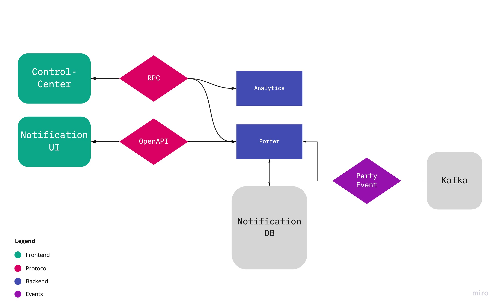

# porter
Сервис для отправки уведомлений мерчантам.
В текущей реализации сервис отвечает за запись и чтение уведомлений мерчанта.

## Общая схема работы сервиса

Frontend делится на две части. В общих чертах функционал такой:

**Control-center**. Предназначен для администраторов. Некоторые из функций который он на себя берет:
- создание/редактирование уведомлений
- поиск уведомление
- поиск мерчантов отвечающих заданным критериям

Протокола взаимодействия [Thrift](https://github.com/rbkmoney/notification-proto)

**Notification UI**. Предназначен для пользователей. Имеет следующий функционал:
- показывает список нотификаций мерчанта
- отмечать нотификации прочитано/не прочитано
- удалять нотификации

Протокол взаимодействия [OpenAPI](https://github.com/rbkmoney/swag-notification)

**Porter**. Имплементирует протоколы для RPC и REST вызовов.
Читает события по party (мерчанту) из Kafka и сохраняет в базу для последующей отправки нотификаций по всем мерчантам

## Ссылки на протоколы
[Thrift](https://github.com/rbkmoney/notification-proto)

[OpenAPI](https://github.com/rbkmoney/swag-notification)
